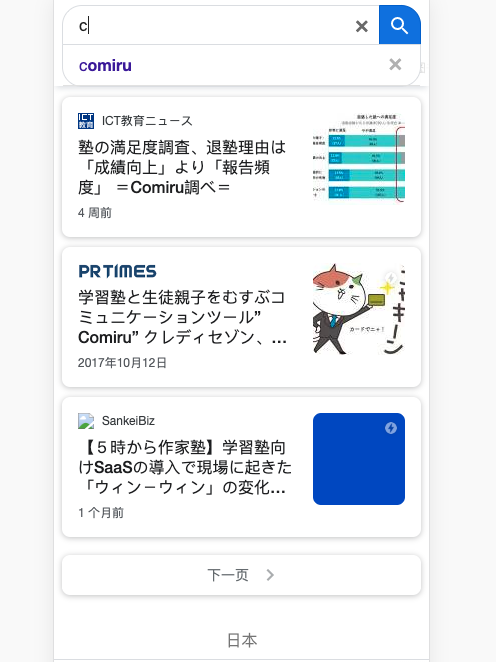

# Issue

## Description 1: 
Please implement a auto-complete tag widget on a text input with the following requirements. 

1. Avoid use any well-known UI libraries ( Like jQuery ) 
   
2. The dataset should contain 100 ~ 1000 entries. 
   
3. User should be blocked from submit the input unless the input matches one of the entries. 
   
4. The whole thing should work when loading from http://localhost/ or file:/// url, without server-side (e.g. PHP) logic. 
   
5. Please take care of memory consumption and efficiency. 
   
6. Consider making your code unit-testable and reusable.  

## Description 2: 
Please implement a image-lazyLoad component with the following requirements. 

1. Avoid use any well-known UI libraries ( Like jQuery )

## Description 3: 
Use Description 1 && Description 2 to complete A News articles List

1. Considering reduce user data when access page
   
2. News can be searched by Description 1 auto-complete tag
   
3. The New list should contain 100 ~ 1000 entries and you need to pagination News
   
4. CSS should be Responsive designed to support
both Desktop browser and mobile browser.

5. Please use ECMAScript 5.
   
Eg:

